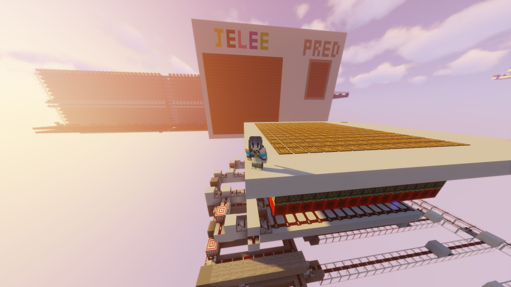

# MCNN
世界首个我的世界强模神经网络

<div align=center>
	
</div>

# 1. Start

## 1.1 Environment

Python == 1.19

Packages
- torch
- torchvision
- tqdm
- numpy
- matplotlib

## 1.2 Run

train model:
```bash
python main.py
```

test model:
```bash
python test.py
```

# 2. Other Function

## 2.1 show weights & generate commands
```bash
python checkPKL.py
```

关于生成的 commands 如何批量使用可以参考 [这篇文章](https://www.bilibili.com/read/cv12244435)

## 2.2 simulate game environment
通过调用 `model.py` 文件中模型的 `simulate_mc()` 方法可以模拟游戏中实际的计算过程

# 3. Todo
1. 添加 log 方便 debug
2. 开发 CNN 版本
3. 开发 Attention 版本
